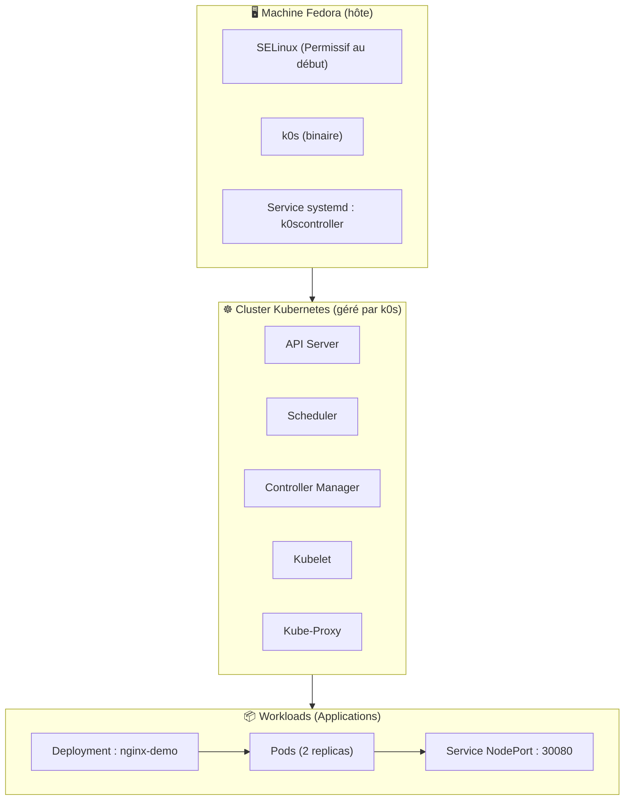

# Tutoriel k0s sur Fedora 44 (version débutant + correctifs SELinux + explications pédagogiques)


Ce tutoriel vous guide pas à pas pour installer k0s, déployer NGINX et comprendre les bases de Kubernetes.

## Table des matières

Vous pouvez naviguer dans ce tutoriel grâce à la table des matières ci‑dessous :


- [0. Préparation](#0-préparation-important)
- [À quoi sert k0s ?](#à-quoi-sert-k0s-)
- [Schéma du cluster k0s](#schéma-du-cluster-k0s)
- [Kubernetes vs installation classique](#kubernetes-vs-installation-classique)
- [1. Vérifier si k0s est installé](#1-vérifier-si-k0s-est-installé)
- [2. Réinitialiser une ancienne installation](#2-optionnel-réinitialiser-une-ancienne-installation)
- [2.1 Installer k0s (méthode officielle)](#21-installer-k0s-méthode-officielle)
- [3. Finaliser l’installation de k0s](#3-finaliser-linstallation-de-k0s)
- [4. Vérifier les composants Kubernetes](#4-vérifier-les-composants-kubernetes)
- [5. Déployer NGINX](#5-déployer-nginx)
- [5.1 Pourquoi via k0s plutôt que via dnf ?](#51-pourquoi-déployer-nginx-via-k0s-plutôt-que-via-dnf-)
- [6. Exposer NGINX via NodePort](#6-exposer-nginx-via-nodeport)
- [7. Tester l’accès](#7-tester-laccès)
- [8. Rolling update](#8-rolling-update)
- [9. Nettoyage](#9-nettoyage)
- [10. Réactiver SELinux](#10-réactiver-selinux-important)
- [11. Dépannage rapide](#11-dépannage-rapide)
- [Glossaire Kubernetes](#glossaire-kubernetes-débutant)
- [Conclusion](#fin-du-fichier-markdown)

---

## 0. Préparation (important)

Sur Fedora, SELinux en mode Enforcing empêche le pod metrics-server de fonctionner.

> 💡 On désactive temporairement SELinux pour éviter que Kubernetes bloque certains composants internes.
>
> 💡 Pour un tutoriel simple, on le met temporairement en mode permissif.


```bash
sudo setenforce 0
sudo k0s kubectl delete pod -n kube-system -l k8s-app=metrics-server 2>/dev/null
```

On réactivera SELinux à la fin.

---

## À quoi sert k0s ?

k0s est une distribution Kubernetes **ultra simple à installer**, pensée pour :

- apprendre Kubernetes
- tester des applications conteneurisées
- déployer rapidement un cluster single-node ou multi-nœuds
- éviter la complexité de kubeadm ou des clusters cloud

En une phrase :

> **k0s = Kubernetes complet, mais sans la douleur.**

Il permet de faire tourner des applications dans des conteneurs, avec :

- isolation
- auto-réparation
- scalabilité
- déploiement déclaratif
- rolling updates
- portabilité totale

---

## Schéma du cluster k0s

Ce schéma illustre la structure du cluster k0s installé dans ce tutoriel.



---

## Kubernetes vs installation classique

```
+-----------------------------+        +-----------------------------+
| Installation classique      |        | Avec k0s (Kubernetes)       |
+-----------------------------+        +-----------------------------+
| dnf install nginx           |        | kubectl apply -f nginx.yaml |
| nginx tourne sur l'hôte     |        | NGINX tourne dans un pod    |
| fichiers dans /etc, /var    |        | isolé dans un conteneur     |
| 1 instance                  |        | plusieurs replicas          |
| mise à jour manuelle        |        | rolling update automatique  |
| si ça plante → réparer      |        | auto-réparation (self-heal) |
+-----------------------------+        +-----------------------------+
```

[⬆️ Retour en haut](#table-des-matières)

---

## 1. Vérifier si k0s est installé

> 💡 On vérifie que k0s est bien installé et fonctionnel avant de continuer.


```bash
sudo which k0s
sudo k0s version
sudo k0s status
sudo systemctl status k0scontroller
```

[⬆️ Retour en haut](#table-des-matières)

---

## 2. (Optionnel) Réinitialiser une ancienne installation

> 💡 Cette étape est utile si on veut repartir d’un cluster propre.


```bash
sudo k0s reset
sudo rm -rf /var/lib/k0s /etc/k0s
sudo rm -f /etc/systemd/system/k0s*.service
sudo systemctl daemon-reload
```

## 2.1 Installer k0s (méthode officielle)

> 📘 Pour aller plus loin ou vérifier les dernières instructions officielles :
>
> • **Référence officielle (version spécifique)** :  
>   https://docs.k0sproject.io/v1.23.6+k0s.2/install/  
>   *Cette page correspond à une version précise de k0s. Elle garantit que les instructions ne changeront jamais, ce qui est utile pour reproduire un environnement à l’identique ou suivre un tutoriel basé sur une version donnée.*
>
> • **Documentation stable (toujours à jour)** :  
>   https://docs.k0sproject.io/stable/install/  
>   *Cette page pointe toujours vers la dernière version stable de k0s. Idéal si vous souhaitez installer k0s avec les instructions les plus récentes.*


> 💡 Cette commande télécharge et installe automatiquement la dernière version stable de k0s.


```bash
curl -sSLf https://get.k0s.sh | sudo sh
```

Sortie attendue :

```
Downloading k0s from URL: https://github.com/k0sproject/k0s/releases/download/v1.35.3+k0s.0/k0s-v1.35.3+k0s.0-amd64
k0s is now executable in /usr/local/bin
You can use it to complete the installation of k0s on this node, 
see https://docs.k0sproject.io/stable/install/ for more information.
```

> 💡 Une fois k0s installé, on peut lancer l’installation du contrôleur en mode single-node.


```bash
sudo k0s install controller --single
sudo k0s start
sudo k0s status
```

Exemple de sortie :

```
Version: v1.35.3+k0s.0
Process ID: 37495
Role: controller
Workloads: true
SingleNode: true
Kube-api probing successful: true
Kube-api probing last error:  
```

> 💡 On vérifie que le nœud apparaît bien dans Kubernetes.


```bash
sudo k0s kubectl get nodes
```

Sortie attendue :

```
NAME      STATUS     ROLES    AGE   VERSION
fedora    NotReady   <none>   14s   v1.35.3+k0s
```

[⬆️ Retour en haut](#table-des-matières)

---

## 3. Finaliser l’installation de k0s

> 💡 Maintenant que k0s est installé, on finalise la configuration du contrôleur et on active le service systemd.
>
> 💡 La commande `k0s install controller --single` est relancée ici pour enregistrer proprement le service systemd, même si elle a déjà été exécutée lors de l’installation initiale.


```bash
sudo k0s install controller --single
sudo systemctl enable --now k0scontroller
sudo systemctl status k0scontroller
```

> 💡 On vérifie que le nœud est bien reconnu par Kubernetes.


Vérifier :

```bash
sudo k0s kubectl get nodes
```

[⬆️ Retour en haut](#table-des-matières)

---

## 4. Vérifier les composants Kubernetes

> 💡 On s’assure que tous les pods système sont bien démarrés.


```bash
sudo k0s kubectl get pods -A
```

Attendre que les pods du namespace kube-system soient Running.

[⬆️ Retour en haut](#table-des-matières)

---

## 5. Déployer NGINX

> 💡 Ce fichier décrit un Deployment, c’est-à-dire une application gérée automatiquement par Kubernetes.


Créer `nginx-deploy.yaml` :

```yaml
apiVersion: apps/v1
kind: Deployment
metadata:
  name: nginx-demo
spec:
  replicas: 2
  selector:
    matchLabels:
      app: nginx-demo
  template:
    metadata:
      labels:
        app: nginx-demo
    spec:
      containers:
        - name: nginx
          image: nginx:stable
          ports:
            - containerPort: 80
```

> 💡 On demande à Kubernetes de créer l’application à partir du fichier YAML.


Appliquer :

```bash
sudo k0s kubectl apply -f nginx-deploy.yaml
```

> 💡 On vérifie que le Deployment et les pods sont bien créés.


Vérifier :

```bash
sudo k0s kubectl get deploy
sudo k0s kubectl get pods -l app=nginx-demo
```

---

## 5.1. Pourquoi déployer NGINX via k0s plutôt que via dnf ?

> 💡 Cette section explique pourquoi on utilise Kubernetes plutôt qu’une installation classique.


Installer NGINX avec `dnf install nginx` installe un service système classique, géré par systemd, qui tourne directement sur l’hôte Fedora. C’est simple, mais cela ne reflète pas le fonctionnement d’une application dans un environnement Kubernetes.

Déployer NGINX via k0s permet de comprendre et de pratiquer plusieurs concepts essentiels :

- Isolation par conteneur : NGINX tourne dans un pod, isolé du système hôte.
- Déploiement déclaratif : on décrit l’état souhaité, Kubernetes le garantit.
- Auto-réparation : si un pod plante, Kubernetes le recrée automatiquement.
- Scalabilité : changer le nombre d’instances se fait en modifiant `replicas`.
- Réseau Kubernetes : un Service NodePort expose l’application proprement.
- Rolling updates : mise à jour sans interruption de service.
- Portabilité : le même YAML fonctionne sur n’importe quel cluster Kubernetes.

En résumé :  
Installer NGINX via `dnf` sert à faire tourner un serveur web sur la machine.  
Le déployer via k0s sert à apprendre et utiliser les mécanismes fondamentaux de Kubernetes.

[⬆️ Retour en haut](#table-des-matières)

---

## 6. Exposer NGINX via NodePort

> 💡 Un Service NodePort permet d’accéder à l’application depuis l’extérieur du cluster.


Créer `nginx-svc.yaml` :

```yaml
apiVersion: v1
kind: Service
metadata:
  name: nginx-nodeport
spec:
  type: NodePort
  selector:
    app: nginx-demo
  ports:
    - port: 80
      targetPort: 80
      nodePort: 30080
```

Appliquer :

```bash
sudo k0s kubectl apply -f nginx-svc.yaml
```

> 💡 On vérifie que le service est bien créé et écoute sur le bon port.


Vérifier :

```bash
sudo k0s kubectl get svc nginx-nodeport
```

[⬆️ Retour en haut](#table-des-matières)

---

## 7. Tester l’accès

Trouver l’IP du nœud :

> 💡 On récupère l’adresse IP de la machine pour tester l’accès depuis l’extérieur.


```bash
ip -4 addr show $(ip route get 8.8.8.8 | awk '{print $5; exit}') | grep -oP '(?<=inet\s)\d+(\.\d+){3}'
```

Tester :

> 💡 On teste que NGINX répond bien via le port exposé par Kubernetes.


```bash
curl http://<NODE_IP>:30080
```

[⬆️ Retour en haut](#table-des-matières)

---

## 8. Rolling update

> 💡 Kubernetes met à jour les pods un par un, sans interruption de service.


```bash
sudo k0s kubectl set image deployment/nginx-demo nginx=nginx:1.25-alpine
sudo k0s kubectl rollout status deployment/nginx-demo
sudo k0s kubectl get pods -l app=nginx-demo
```

[⬆️ Retour en haut](#table-des-matières)

---

## 9. Nettoyage

> 💡 On supprime toutes les ressources créées et on réinitialise k0s.


```bash
sudo k0s kubectl delete -f nginx-svc.yaml
sudo k0s kubectl delete -f nginx-deploy.yaml
sudo systemctl stop --now k0scontroller
sudo systemctl disable k0scontroller
sudo k0s reset
```

[⬆️ Retour en haut](#table-des-matières)

---

## 10. Réactiver SELinux (important)

> 💡 On remet SELinux en mode sécurisé une fois la démonstration terminée.


```bash
sudo setenforce 1
```

[⬆️ Retour en haut](#table-des-matières)

---

## 11. Dépannage rapide

> 💡 Quelques commandes utiles pour diagnostiquer un problème dans Kubernetes.


Logs k0s :

```bash
sudo journalctl -u k0scontroller -f
```

Logs d’un pod :

```bash
sudo k0s kubectl logs <pod-name>
```

Description d’un pod :

```bash
sudo k0s kubectl describe pod <pod-name>
```

Vérifier les ressources :

```bash
free -h
df -h
top
```

[⬆️ Retour en haut](#table-des-matières)

---
## Glossaire Kubernetes (débutant)

> 💡 Ce glossaire regroupe les termes essentiels rencontrés dans ce tutoriel.

### Cluster
Ensemble de machines (physiques ou virtuelles) sur lesquelles Kubernetes déploie et gère des applications.

### Node (nœud)
Machine du cluster.  
Dans ce tutoriel : la machine Fedora.

### Pod
Plus petite unité d’exécution dans Kubernetes.  
Contient un ou plusieurs conteneurs.

### Container (conteneur)
Application empaquetée avec tout ce qu’il faut pour tourner.  
Exemple : l’image `nginx:stable`.

### Deployment
Objet Kubernetes qui gère automatiquement :
- le nombre de pods  
- leur mise à jour  
- leur redémarrage en cas de crash  

### Service
Objet qui expose une application.  
Il fournit une adresse stable, même si les pods changent.

### NodePort
Type de Service qui ouvre un port sur le nœud (ex : `30080`) pour accéder à l’application depuis l’extérieur.

### YAML
Format de fichier utilisé pour décrire les ressources Kubernetes (Deployment, Service, etc.).

### Namespace
Espace logique pour organiser les ressources.  
Exemple : `kube-system` contient les composants internes de Kubernetes.

### Rolling update
Mise à jour progressive des pods, sans interruption de service.

### Self‑healing
Capacité de Kubernetes à recréer automatiquement un pod qui plante.

---

Vous avez maintenant un cluster Kubernetes fonctionnel, un service exposé, un rolling update, et les bases pour aller plus loin.

[⬆️ Retour en haut](#table-des-matières)

# Fin du fichier Markdown

