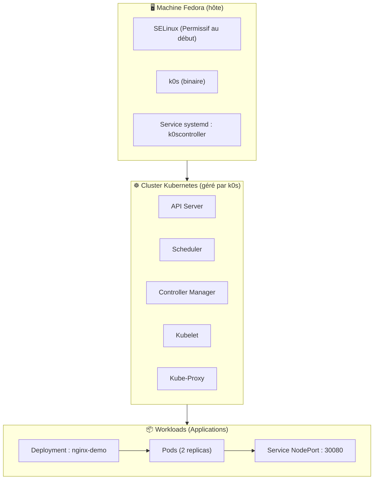

# Installation et prise en main de k0s sur Fedora

Ce tutoriel s’adresse à des débutants curieux qui :

- connaissent un peu Linux (ligne de commande, sudo)
- ont déjà entendu parler de conteneurs ou de Docker
- veulent comprendre concrètement ce que fait Kubernetes, sans passer par un cloud

À la fin, vous saurez :

- installer k0s sur Fedora 44
- vérifier l’état d’un cluster Kubernetes
- déployer une application (NGINX) avec un Deployment
- l’exposer via un Service NodePort
- faire un rolling update sans coupure

## Table des matières

Vous pouvez naviguer dans ce tutoriel grâce à la table des matières ci‑dessous :


- [1. Préparation](#1-préparation-important)
- [2. À quoi sert k0s ?](#2-à-quoi-sert-k0s-)
- [3. Schéma du cluster k0s](#3-schéma-du-cluster-k0s)
- [4. Kubernetes vs installation classique](#4-kubernetes-vs-installation-classique)
- [5. Vérifier si k0s est installé](#5-vérifier-si-k0s-est-installé)
- [6. Réinitialiser une ancienne installation](#6-optionnel-réinitialiser-une-ancienne-installation)
  - [6.1 Installer k0s (méthode officielle)](#61-installer-k0s-méthode-officielle)
- [7. Finaliser l’installation de k0s](#7-finaliser-linstallation-de-k0s)
  - [7.1 Rendre kubectl utilisable globalement](#71-rendre-kubectl-utilisable-globalement-wrapper--sudoers)
- [8. Vérifier les composants Kubernetes](#8-vérifier-les-composants-kubernetes)
- [9. Déployer NGINX](#9-déployer-nginx)
  - [9.1 Pourquoi via k0s plutôt que via dnf ?](#91-pourquoi-déployer-nginx-via-k0s-plutôt-que-via-dnf-)
- [10. Exposer NGINX via NodePort](#10-exposer-nginx-via-nodeport)
- [11. Tester l’accès](#11-tester-laccès)
- [12. Rolling update](#12-rolling-update)
- [13. Nettoyage](#13-nettoyage)
- [14. Réactiver SELinux](#14-réactiver-selinux)
- [15. Dépannage rapide](#15-dépannage-rapide)
- [16. Glossaire Kubernetes](#16-glossaire-kubernetes-débutant)
- [17. Conclusion](#17-conclusion)

---

## 1. Préparation (important)

Sur Fedora, SELinux en mode Enforcing peut empêcher certains composants Kubernetes de fonctionner correctement, notamment le pod `metrics-server`.

Concrètement, si on ne le met pas temporairement en mode permissif :

- certains pods système restent en statut `CrashLoopBackOff` ou `Error`
- les métriques de ressources (CPU/RAM) ne remontent pas correctement
- le comportement du cluster devient difficile à comprendre pour un débutant

Pour garder le tutoriel simple, on met SELinux en mode permissif au début, puis on le réactive à la fin.

⚠️ En production, on ne ferait **jamais** ça sans une vraie politique de sécurité adaptée.


```bash
sudo setenforce 0
sudo k0s kubectl delete pod -n kube-system -l k8s-app=metrics-server 2>/dev/null
```

On réactivera SELinux à la fin.

[⬆️ Retour en haut](#table-des-matières)

---

## 2. À quoi sert k0s ?

k0s est une distribution Kubernetes **ultra simple à installer**, pensée pour :

- apprendre Kubernetes
- tester des applications conteneurisées
- déployer rapidement un cluster single-node ou multi-nœuds
- éviter la complexité de kubeadm ou des clusters cloud

En une phrase :

> **k0s = Kubernetes complet, mais sans la douleur.**

Il permet de faire tourner des applications dans des conteneurs, avec :

- isolation
- auto-réparation
- scalabilité
- déploiement déclaratif
- rolling updates
- portabilité totale

[⬆️ Retour en haut](#table-des-matières)

---

## 3. Schéma du cluster k0s

Ce schéma illustre la structure du cluster k0s installé dans ce tutoriel.



[⬆️ Retour en haut](#table-des-matières)

---

## 4. Kubernetes vs installation classique

```
+-----------------------------+        +-----------------------------+
| Installation classique      |        | Avec k0s (Kubernetes)       |
+-----------------------------+        +-----------------------------+
| dnf install nginx           |        | kubectl apply -f nginx.yaml |
| nginx tourne sur l'hôte     |        | NGINX tourne dans un pod    |
| fichiers dans /etc, /var    |        | isolé dans un conteneur     |
| 1 instance                  |        | plusieurs replicas          |
| mise à jour manuelle        |        | rolling update automatique  |
| si ça plante → réparer      |        | auto-réparation (self-heal) |
+-----------------------------+        +-----------------------------+
```

[⬆️ Retour en haut](#table-des-matières)

---

## 5. Vérifier si k0s est installé

> 💡 On vérifie que k0s est bien installé et fonctionnel avant de continuer.

### Vérifier la présence du binaire

```bash
sudo which k0s
```

- Vérifie que le binaire `k0s` est présent dans le PATH.
- Si rien ne s’affiche : k0s n’est pas installé ou pas dans `/usr/local/bin`.

---

### Vérifier la version installée

```bash
sudo k0s version
```

- Affiche la version exacte de k0s installée.
- Utile pour comparer avec la documentation ou diagnostiquer un problème.

---

### Vérifier l’état du nœud selon k0s

```bash
sudo k0s status
```

- Affiche l’état du nœud du point de vue de k0s.
- Informations importantes :
  - `Role: controller` → la machine joue le rôle de contrôleur
  - `Workloads: true` → elle peut exécuter des pods
  - `SingleNode: true` → cluster tout‑en‑un

---

### Vérifier le service systemd k0scontroller

```bash
sudo systemctl status k0scontroller
```

- Vérifie que le service systemd créé par k0s est actif.
- `k0scontroller` est le service qui lance k0s en mode *controller*.

---

### Vérifier que Kubernetes répond

```bash
sudo k0s kubectl get nodes
```

- Interroge l’API Kubernetes via le kubectl intégré à k0s.
- Le nœud doit apparaître (même en `NotReady` juste après l’installation).


[⬆️ Retour en haut](#table-des-matières)

---

## 6. (Optionnel) Réinitialiser une ancienne installation

> 💡 Cette étape permet de repartir d’un cluster totalement propre.
>
> ⚠️ Attention : cette opération est **destructive**. Toutes les données k0s seront supprimées.

### Réinitialiser k0s proprement

```bash
sudo k0s reset
```

- Demande à k0s de se désinstaller proprement.
- Arrête les composants k0s.
- Supprime les conteneurs gérés par k0s.
- Nettoie les volumes et les données internes.
- Efface le répertoire de données `/var/lib/k0s`.

---

### Supprimer manuellement les fichiers restants

```bash
sudo rm -rf /var/lib/k0s /etc/k0s
```

- Supprime toute configuration résiduelle.
- Évite que d’anciens fichiers perturbent une nouvelle installation.

---

### Supprimer les services systemd k0s

```bash
sudo rm -f /etc/systemd/system/k0s*.service
sudo systemctl daemon-reload
```

- Supprime les unités systemd (`k0scontroller`, etc.).
- Recharge systemd pour prendre en compte les suppressions.

---

### (Optionnel) Vérifier que tout est propre

```bash
systemctl list-units | grep k0s
ls /var/lib/k0s /etc/k0s
```

- Aucune unité systemd k0s ne doit apparaître.
- Les répertoires `/var/lib/k0s` et `/etc/k0s` doivent être absents.

[⬆️ Retour en haut](#table-des-matières)

## 6.1 Installer k0s (méthode officielle)

> 💡 Cette étape installe le binaire k0s depuis le script officiel du projet.
>
> 💡 Le script télécharge automatiquement la dernière version stable compatible avec votre système.

### Télécharger et installer k0s

```bash
curl -sSLf https://get.k0s.sh | sudo sh
```

- Télécharge la dernière version stable de k0s.
- Installe le binaire dans `/usr/local/bin/k0s`.
- Ne configure pas encore le cluster : seule l’installation du binaire est effectuée.

Sortie typique :

```
Downloading k0s from URL: https://github.com/k0sproject/k0s/releases/download/vX.Y.Z/k0s-vX.Y.Z-amd64
k0s is now executable in /usr/local/bin
You can use it to complete the installation of k0s on this node.
```

---

### Vérifier que k0s est bien installé

```bash
sudo k0s version
```

- Confirme que le binaire est fonctionnel.
- Affiche la version installée.

---

### Installer le contrôleur en mode single-node

```bash
sudo k0s install controller --single
```

- Configure cette machine comme **contrôleur Kubernetes**.
- Active aussi l’exécution des **workloads** (pods) sur ce même nœud.
- Crée le service systemd `k0scontroller`.

---

### Démarrer k0s

```bash
sudo k0s start
```

- Démarre le service systemd créé précédemment.
- Lance les composants Kubernetes (API server, scheduler, controller-manager, kubelet, etc.).

---

### Vérifier l’état du service

```bash
sudo k0s status
```

- Confirme que k0s fonctionne correctement.
- Affiche le rôle du nœud, le PID, et l’état de l’API Kubernetes.

---

### Vérifier que le nœud apparaît dans Kubernetes

```bash
sudo k0s kubectl get nodes
```

- Interroge l’API Kubernetes via le kubectl intégré à k0s.
- Le nœud apparaît généralement en `NotReady` pendant quelques secondes, le temps que les composants démarrent.


[⬆️ Retour en haut](#table-des-matières)

---

## 7. Finaliser l’installation de k0s

> 💡 Cette étape active le service systemd créé par k0s et démarre réellement le cluster Kubernetes.
>
> 💡 Elle est nécessaire même si `k0s install controller --single` a déjà été exécuté juste après l’installation du binaire.

### Installer (ou réinstaller proprement) le service systemd

```bash
sudo k0s install controller --single
```

- Configure cette machine comme **contrôleur Kubernetes**.
- Active aussi l’exécution des **workloads** (pods) sur ce même nœud.
- Crée ou met à jour le service systemd `k0scontroller`.

---

### Activer et démarrer le service systemd

```bash
sudo systemctl enable --now k0scontroller
```

- Active le service au démarrage de la machine.
- Démarre immédiatement k0s.
- Lance les composants Kubernetes : API Server, Scheduler, Controller Manager, Kubelet, etc.

---

### Vérifier l’état du service

```bash
sudo systemctl status k0scontroller
```

- Permet de vérifier que le service est bien actif (`active (running)`).
- En cas de problème, les logs systemd aideront à diagnostiquer.

---

### Vérifier que Kubernetes reconnaît le nœud

```bash
sudo k0s kubectl get nodes
```

- Interroge l’API Kubernetes via le kubectl intégré à k0s.
- Le nœud doit apparaître en `Ready` une fois que tous les composants sont démarrés.

[⬆️ Retour en haut](#table-des-matières)

---

## 7.1 Rendre kubectl utilisable globalement (wrapper + sudoers)

> 💡 Par défaut, k0s n’installe pas `kubectl` comme un binaire global.
>
> 💡 Il faut normalement utiliser : `sudo k0s kubectl ...`
>
> 💡 Cette section rend `kubectl` utilisable comme dans n’importe quel cluster Kubernetes.

### Créer un wrapper kubectl

Créer le fichier :

```bash
sudo vi /usr/local/bin/kubectl
```

Contenu du fichier :

```sh
#!/bin/sh
sudo k0s kubectl "$@"
```

Rendre le fichier exécutable :

```bash
sudo chmod +x /usr/local/bin/kubectl
```

Tester :

```bash
kubectl version
```

---

### Autoriser kubectl à s’exécuter sans mot de passe

Créer un fichier sudoers dédié :

```bash
sudo visudo -f /etc/sudoers.d/k0s-kubectl
```

Ajouter la ligne suivante (remplacer `<utilisateur>` par votre nom d’utilisateur) :

```
<utilisateur> ALL=(ALL) NOPASSWD: /usr/bin/k0s kubectl *
```

Exemple pour un utilisateur nommé `john` :

```
john ALL=(ALL) NOPASSWD: /usr/bin/k0s kubectl *
```

Tester que sudo ne demande pas de mot de passe :

```bash
sudo -n k0s kubectl version
```

---

### Pourquoi ce wrapper est utile ?

- Permet d’utiliser `kubectl` comme dans n’importe quel tutoriel Kubernetes.  
- Évite d’installer un binaire kubectl séparé.  
- Assure que la version de kubectl correspond toujours à celle de k0s.  
- Permet l’usage dans des scripts ou CI/CD sans interaction.  


[⬆️ Retour en haut](#table-des-matières)

---

## 8. Vérifier les composants Kubernetes

> 💡 Après le démarrage de k0s, Kubernetes lance automatiquement plusieurs pods système.
>
> 💡 Cette étape permet de vérifier que tous les composants essentiels sont bien en cours d’exécution.

### Afficher tous les pods de tous les namespaces

```bash
kubectl get pods -A
```

- Liste l’ensemble des pods du cluster.
- Permet de vérifier l’état des composants internes (API server, scheduler, controller-manager, coredns, kube-proxy, etc.).
- Les pods du namespace `kube-system` doivent passer en `Running` ou `Completed`.

---

### Ce que vous devez observer

- `coredns` : doit être en `Running` (service DNS interne du cluster).
- `kube-proxy` : doit être en `Running` (gestion du réseau des pods).
- `metrics-server` : peut mettre quelques secondes à démarrer.
- `k0s-controller` / `k0s-worker` : selon la configuration single-node.

Si certains pods restent en `Pending` ou `CrashLoopBackOff`, vous pouvez consulter leurs logs :

```bash
kubectl logs -n kube-system <nom-du-pod>
```

Ou obtenir une description détaillée :

```bash
kubectl describe pod -n kube-system <nom-du-pod>
```

[⬆️ Retour en haut](#table-des-matières)

---

## 9. Déployer NGINX

> 💡 Cette étape montre comment déployer une application dans Kubernetes à l’aide d’un Deployment.
>
> 💡 Un Deployment garantit qu’un nombre donné de pods est toujours en cours d’exécution.

### Créer le fichier de déploiement

Créer un fichier nommé `nginx-deploy.yaml` :

```yaml
apiVersion: apps/v1
kind: Deployment
metadata:
  name: nginx-demo
spec:
  replicas: 2
  selector:
    matchLabels:
      app: nginx-demo
  template:
    metadata:
      labels:
        app: nginx-demo
    spec:
      containers:
        - name: nginx
          image: nginx:stable
          ports:
            - containerPort: 80
```

- `replicas: 2` → Kubernetes maintient toujours 2 pods NGINX en fonctionnement.
- `image: nginx:stable` → image officielle NGINX.
- `containerPort: 80` → port exposé dans le conteneur.

---

### Appliquer le déploiement

```bash
kubectl apply -f nginx-deploy.yaml
```

- Demande à Kubernetes de créer le Deployment.
- Kubernetes crée automatiquement les pods associés.

---

### Vérifier que le Deployment est créé

```bash
kubectl get deploy
```

- Affiche les Deployments existants.
- La colonne `READY` doit afficher `2/2`.

---

### Vérifier les pods créés

```bash
kubectl get pods -l app=nginx-demo
```

- Filtre les pods ayant le label `app=nginx-demo`.
- Les pods doivent être en `Running`.

---

### (Optionnel) Voir les détails d’un pod

```bash
kubectl describe pod -l app=nginx-demo
```

- Affiche les événements, l’image utilisée, les volumes, etc.

[⬆️ Retour en haut](#table-des-matières)

---

## 9.1 Pourquoi déployer NGINX via k0s plutôt que via dnf ?

> 💡 Installer NGINX via `dnf` fonctionne, mais cela ne reflète pas le fonctionnement d’une application dans Kubernetes.
>
> 💡 Déployer NGINX via k0s permet de comprendre les mécanismes fondamentaux d’un cluster Kubernetes.

### Installation classique (dnf)

- L’application tourne directement sur l’hôte Fedora.
- Le service est géré par systemd.
- Les fichiers sont stockés dans `/etc/nginx` et `/var/www`.
- Une seule instance tourne par défaut.
- La mise à jour est manuelle.
- Si le service plante, il faut intervenir soi-même.

### Déploiement via Kubernetes (k0s)

- L’application tourne dans un **pod**, isolé du système hôte.
- Le déploiement est **déclaratif** : on décrit l’état souhaité dans un fichier YAML.
- Kubernetes garantit automatiquement :
  - le nombre de pods (`replicas`)
  - leur redémarrage en cas de crash (**self‑healing**)
  - les mises à jour progressives (**rolling updates**)
- Le réseau est géré par Kubernetes (Services, NodePort, ClusterIP).
- Le même fichier YAML fonctionne sur n’importe quel cluster Kubernetes.

### En résumé

Installer NGINX via `dnf` sert à faire tourner un serveur web sur la machine.  
Le déployer via k0s sert à **apprendre Kubernetes** et à comprendre comment les applications sont réellement gérées dans un cluster moderne.

[⬆️ Retour en haut](#table-des-matières)

---

## 10. Exposer NGINX via NodePort

> 💡 Un Service de type **NodePort** permet d’accéder à une application Kubernetes depuis l’extérieur du cluster.
>
> 💡 Kubernetes ouvre un port sur le nœud (ex : 30080) et redirige le trafic vers les pods NGINX.

### Créer le fichier de Service

Créer un fichier nommé `nginx-svc.yaml` :

```yaml
apiVersion: v1
kind: Service
metadata:
  name: nginx-nodeport
spec:
  type: NodePort
  selector:
    app: nginx-demo
  ports:
    - port: 80
      targetPort: 80
      nodePort: 30080
```

- `type: NodePort` → expose l’application sur un port du nœud.
- `port: 80` → port du Service dans le cluster.
- `targetPort: 80` → port du conteneur NGINX.
- `nodePort: 30080` → port accessible depuis l’extérieur.

---

### Appliquer le Service

```bash
kubectl apply -f nginx-svc.yaml
```

- Crée le Service dans Kubernetes.
- Ouvre le port 30080 sur le nœud.

---

### Vérifier que le Service est actif

```bash
kubectl get svc nginx-nodeport
```

- Affiche les informations du Service.
- La colonne `PORT(S)` doit contenir quelque chose comme :  
  `80:30080/TCP`

---

### (Optionnel) Vérifier les endpoints associés

```bash
kubectl get endpoints nginx-nodeport
```

- Permet de vérifier que le Service pointe bien vers les pods NGINX.
- Les IP listées doivent correspondre aux pods du Deployment.


[⬆️ Retour en haut](#table-des-matières)

---

## 11. Tester l’accès

> 💡 Maintenant que le Service NodePort est créé, on peut tester l’accès à NGINX depuis l’extérieur du cluster.
>
> 💡 L’idée : récupérer l’IP du nœud, puis accéder au port 30080 exposé par Kubernetes.

### Récupérer l’adresse IP du nœud

```bash
ip -4 addr show $(ip route get 8.8.8.8 | awk '{print $5; exit}') | grep -oP '(?<=inet\s)\d+(\.\d+){3}'
```

- Détecte automatiquement l’interface réseau utilisée pour sortir vers Internet.
- Affiche l’adresse IPv4 du nœud Fedora.

---

### Tester l’accès à NGINX via NodePort

```bash
curl http://<NODE_IP>:30080
```

- Remplacer `<NODE_IP>` par l’adresse obtenue ci‑dessus.
- Si tout fonctionne, vous devez voir la page HTML par défaut de NGINX.

---

### (Optionnel) Tester depuis un navigateur

Ouvrir :

```
http://<NODE_IP>:30080
```

- Vous devriez voir la page “Welcome to nginx!”.


[⬆️ Retour en haut](#table-des-matières)

---

## 12. Rolling update

> 💡 Un *rolling update* permet de mettre à jour une application sans interruption de service.
>
> 💡 Kubernetes remplace les pods un par un, en s’assurant qu’au moins un pod reste disponible.

### Mettre à jour l’image du Deployment

```bash
kubectl set image deployment/nginx-demo nginx=nginx:1.25-alpine
```

- Met à jour l’image du conteneur `nginx` dans le Deployment.
- Kubernetes crée de nouveaux pods avec la nouvelle image.
- Les anciens pods sont arrêtés uniquement lorsque les nouveaux sont prêts.

---

### Suivre la progression du rolling update

```bash
kubectl rollout status deployment/nginx-demo
```

- Affiche l’avancement de la mise à jour.
- Le rolling update est terminé lorsque le message indique que le Deployment est à jour.

---

### Vérifier les pods après la mise à jour

```bash
kubectl get pods -l app=nginx-demo
```

- Permet de voir les nouveaux pods créés.
- Les anciens pods ne doivent plus apparaître.

---

### (Optionnel) Voir l’historique des déploiements

```bash
kubectl rollout history deployment/nginx-demo
```

- Affiche les différentes révisions du Deployment.
- Utile pour vérifier les changements appliqués.

---

### (Optionnel) Revenir à la version précédente

```bash
kubectl rollout undo deployment/nginx-demo
```

- Permet de revenir à la révision précédente en cas de problème.

[⬆️ Retour en haut](#table-des-matières)

---

## 13. Nettoyage

> 💡 Cette étape permet de supprimer les ressources créées durant le tutoriel.
>
> 💡 Elle est utile pour repartir sur un cluster propre ou éviter de consommer des ressources inutilement.

### Supprimer le Service NodePort

```bash
kubectl delete -f nginx-svc.yaml
```

- Supprime le Service `nginx-nodeport`.
- Le port 30080 n’est plus exposé sur le nœud.

---

### Supprimer le Deployment NGINX

```bash
kubectl delete -f nginx-deploy.yaml
```

- Supprime le Deployment `nginx-demo`.
- Kubernetes supprime automatiquement les pods associés.

---

### Vérifier que tout est supprimé

```bash
kubectl get pods
kubectl get svc
```

- Aucun pod `nginx-demo` ne doit apparaître.
- Aucun Service `nginx-nodeport` ne doit apparaître.

---

### (Optionnel) Supprimer les fichiers YAML

```bash
rm -f nginx-deploy.yaml nginx-svc.yaml
```

- Nettoie les fichiers locaux utilisés pour le tutoriel.

[⬆️ Retour en haut](#table-des-matières)

---

## 14. Réactiver SELinux

> 💡 Si vous aviez désactivé SELinux pour simplifier l’installation ou le débogage, il est recommandé de le réactiver une fois que k0s fonctionne correctement.
>
> 💡 SELinux en mode *enforcing* améliore significativement la sécurité du système.

### Vérifier l’état actuel de SELinux

```bash
getenforce
```

- Affiche l’état actuel : `Enforcing`, `Permissive` ou `Disabled`.

---

### Réactiver SELinux en mode permissif (étape intermédiaire recommandée)

```bash
sudo setenforce 0
```

- Passe SELinux en mode *permissive* sans redémarrage.
- Permet de tester que k0s fonctionne correctement avant de revenir en *enforcing*.

Pour rendre ce mode persistant :

```bash
sudo sed -i 's/^SELINUX=.*/SELINUX=permissive/' /etc/selinux/config
```

---

### Réactiver SELinux en mode enforcing

```bash
sudo setenforce 1
```

Pour rendre ce mode persistant :

```bash
sudo sed -i 's/^SELINUX=.*/SELINUX=enforcing/' /etc/selinux/config
```

---

### Redémarrer la machine (recommandé)

```bash
sudo reboot
```

- Assure que toutes les politiques SELinux sont correctement appliquées.
- Vérifie ensuite :

```bash
getenforce
```

Vous devez obtenir :

```
Enforcing
```

[⬆️ Retour en haut](#table-des-matières)

---

## 15. Dépannage rapide

> 💡 Cette section regroupe les problèmes les plus fréquents rencontrés lors de l’installation ou de l’utilisation de k0s.

### Le nœud reste en NotReady

```bash
kubectl get nodes
```

Causes possibles :
- Les pods système ne sont pas encore démarrés.
- Le kubelet n’arrive pas à joindre l’API server.
- SELinux bloque certains composants.

Vérifier les pods système :

```bash
kubectl get pods -A
```

---

### Les pods restent en Pending

Causes possibles :
- Pas assez de ressources (CPU/RAM).
- Le scheduler ne peut pas placer les pods.
- Le réseau CNI n’est pas prêt.

Vérifier les événements :

```bash
kubectl describe pod <nom-du-pod>
```

---

### Les pods sont en CrashLoopBackOff

Causes possibles :
- Mauvaise image.
- Mauvaise configuration.
- Port déjà utilisé.

Voir les logs :

```bash
kubectl logs <nom-du-pod>
```

---

### Impossible d’accéder au NodePort

Vérifier que le service est bien créé :

```bash
kubectl get svc
```

Vérifier les endpoints :

```bash
kubectl get endpoints nginx-nodeport
```

Vérifier que le port est ouvert sur le nœud :

```bash
sudo ss -tulpn | grep 30080
```

---

### kubectl demande un mot de passe sudo

Le wrapper n’est pas configuré correctement.

Vérifier le fichier sudoers :

```bash
sudo visudo -f /etc/sudoers.d/k0s-kubectl
```

---

### k0s ne démarre pas

Vérifier le service systemd :

```bash
sudo systemctl status k0scontroller
```

Voir les logs :

```bash
sudo journalctl -u k0scontroller -f
```

---

### Réinitialiser complètement k0s

```bash
sudo k0s reset
sudo rm -rf /var/lib/k0s /etc/k0s
sudo systemctl daemon-reload
```

[⬆️ Retour en haut](#table-des-matières)

---

## 16. Glossaire Kubernetes (débutant)

> 💡 Ce glossaire regroupe les termes essentiels pour comprendre Kubernetes et k0s.
> 💡 Il est volontairement simplifié pour les débutants.

### Cluster
Ensemble de machines (physiques ou virtuelles) qui exécutent Kubernetes.

### Node (nœud)
Machine qui fait partie du cluster.  
Peut être :
- **Control Plane** : gère le cluster.
- **Worker** : exécute les applications.

### Pod
Plus petite unité d’exécution dans Kubernetes.  
Contient un ou plusieurs conteneurs.

### Container
Application empaquetée avec tout ce qu’il faut pour fonctionner.  
Exemple : un conteneur NGINX.

### Deployment
Objet Kubernetes qui gère un groupe de pods identiques.  
Assure :
- le redémarrage automatique  
- la mise à l’échelle  
- les mises à jour progressives (rolling updates)

### Service
Objet qui expose un ou plusieurs pods via une adresse stable.  
Les pods peuvent changer, mais le Service reste le même.

### NodePort
Type de Service qui ouvre un port sur le nœud (ex : 30080) pour accéder à l’application depuis l’extérieur.

### ClusterIP
Type de Service interne au cluster.  
Non accessible depuis l’extérieur.

### Namespace
Espace logique pour organiser les ressources.  
Exemple : `default`, `kube-system`.

### kubelet
Agent qui tourne sur chaque nœud et gère les pods.

### kube-proxy
Composant réseau qui route le trafic vers les bons pods.

### coredns
Serveur DNS interne du cluster.  
Permet aux pods de se résoudre entre eux via des noms DNS.

### API Server
Point d’entrée de Kubernetes.  
Toutes les commandes `kubectl` passent par lui.

### YAML
Format de fichier utilisé pour décrire les ressources Kubernetes.  
Exemple : Deployment, Service, Namespace, etc.

### Rolling update
Mise à jour progressive d’un Deployment, sans interruption de service.

### Wrapper
Petit script qui simplifie une commande.  
Exemple : wrapper `kubectl` pour éviter `sudo k0s kubectl`.

### SELinux
Mécanisme de sécurité renforcée sous Linux.  
Peut être en mode :
- **enforcing**
- **permissive**
- **disabled**

[⬆️ Retour en haut](#table-des-matières)

---

## 17. Conclusion

Vous disposez maintenant d’un cluster Kubernetes fonctionnel basé sur k0s, capable d’exécuter des applications, de les exposer, de les mettre à jour sans interruption et de s’auto‑réparer.  
Vous avez également vu comment :

- installer et configurer k0s  
- utiliser kubectl de manière fluide  
- déployer une application (NGINX)  
- exposer un service via NodePort  
- réaliser un rolling update  
- diagnostiquer les problèmes courants  
- comprendre les concepts essentiels de Kubernetes  

Ce guide constitue une base solide pour aller plus loin.  
Les prochaines étapes possibles incluent :

- explorer les Ingress Controllers  
- ajouter un second nœud au cluster  
- déployer une base de données ou une application plus complexe  
- mettre en place un stockage persistant (PersistentVolumes)  
- installer un tableau de bord Kubernetes (Lens, k9s, Dashboard)  

Kubernetes est un vaste écosystème : chaque étape que vous maîtrisez ouvre la porte à de nouvelles possibilités.  
Bonne exploration !

[⬆️ Retour en haut](#table-des-matières)

# Fin du fichier Markdown

